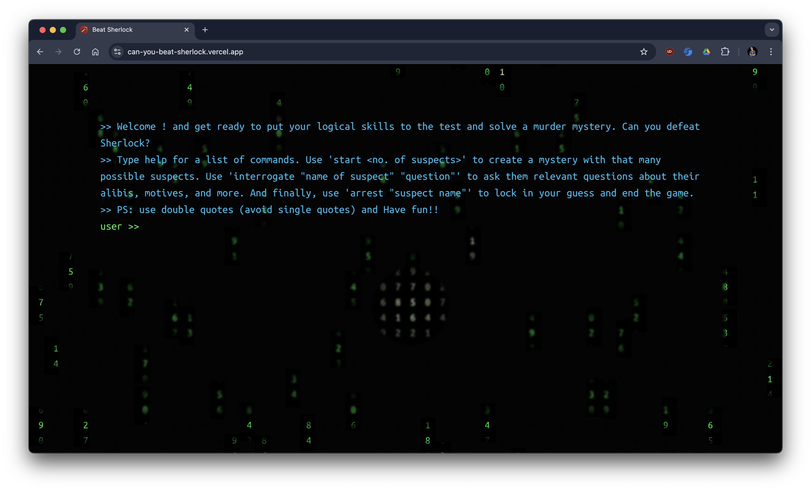
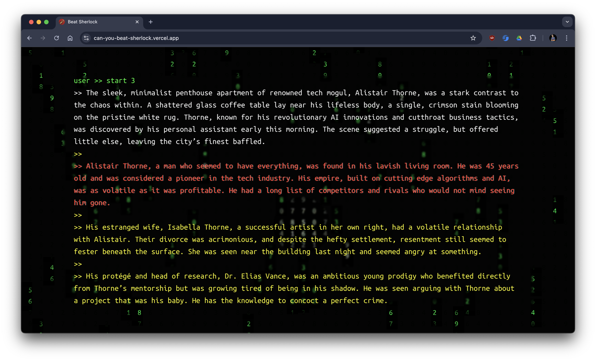

# Can You Beat Sherlock?

Welcome to **Can You Beat Sherlock?**, the game where you put your detective skills to the ultimate test! 🕵️‍♂️🔍


## Introduction
Think you have what it takes to outsmart the world's greatest detective? Think again! This game will challenge your logic, wit, and patience. If you can solve these mysteries in this AI powered terminal themed game, you just might be as smart as The Sherlock Holmes.

## Demo
[ Visit Website ](https://can-you-beat-sherlock.vercel.app/)

## Screenshota




## Installation
To get started, Clone this repository and install the necessary dependencies.

```bash
git clone https://github.com/Agrim-Bansal/can-you-beat-sherlock.git
cd can-you-beat-sherlock
npm install
```

## Gameplay
1. **Start the Game**: 

    get gemini api key from google ai studio and put it in .env file

    GEMINI_API_KEY=< api key >

    Then

    ```bash
    npm run dev
    ```

2. **Solve Mysteries**: Write ` start <no. of suspects>` to generate a unique mystery story. Use your logical reasoning to solve the mystery. Remember, Sherlock is watching!

3. **Proceed**: Interrogate suspects and gather clues to solve the mystery. You can ask suspects about their alibis, motives, and more. But be careful! You only have a limited number of questions.

4. **Available Commands** :
- `start <no. of suspects>` : Start a new game with the specified number of suspects.
- `interrogate "name of suspect" "question"` : Interrogate a suspect to gather clues.


5. **Win**: If you manage to solve the mystery, congratulations! You've beaten Sherlock. Now go brag about it.


Good luck, detective! And remember, when you have eliminated the impossible, whatever remains, however improbable, must be the truth. 🕵️‍♀️
